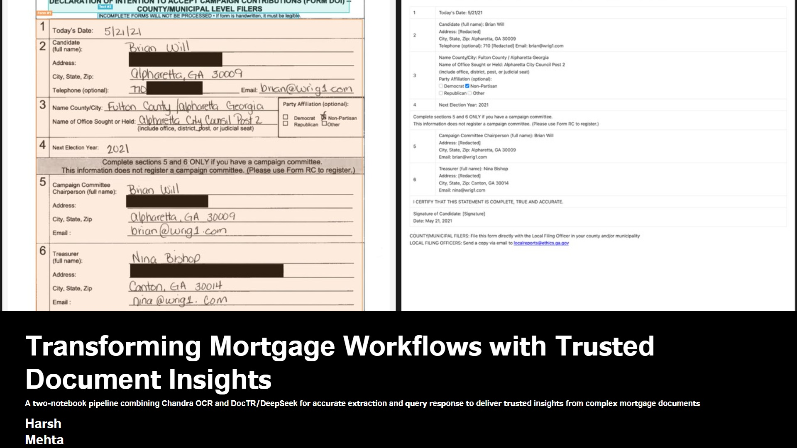
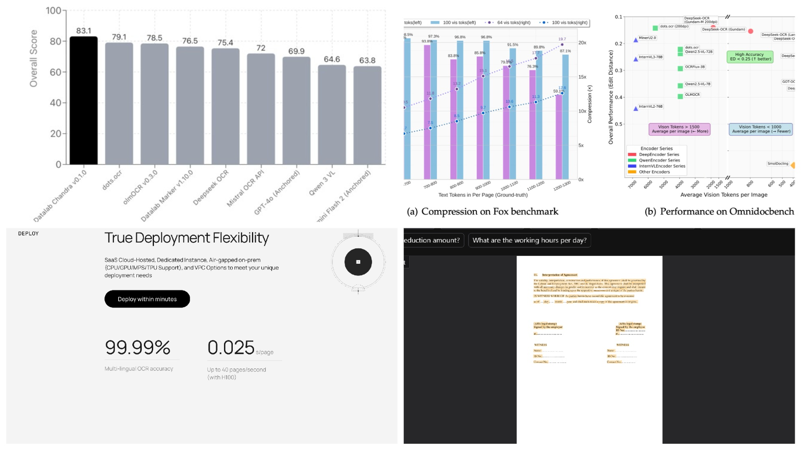
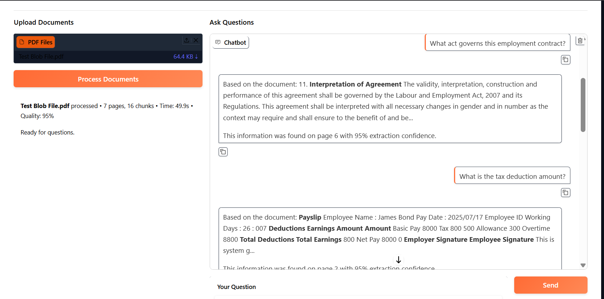
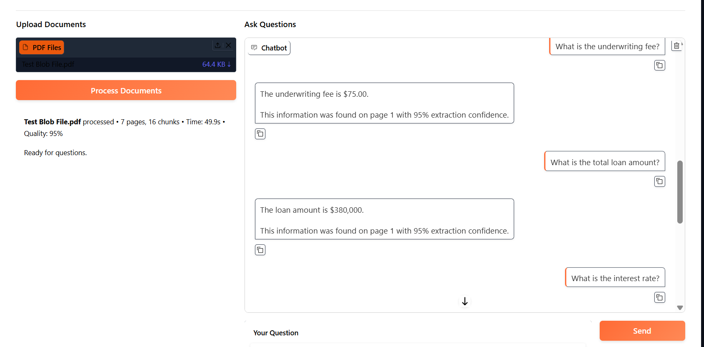
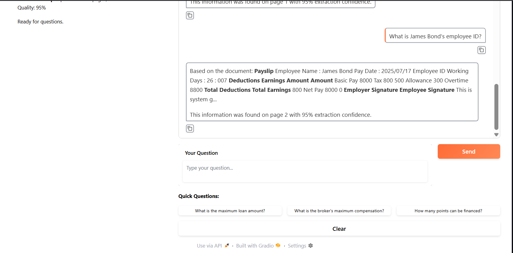
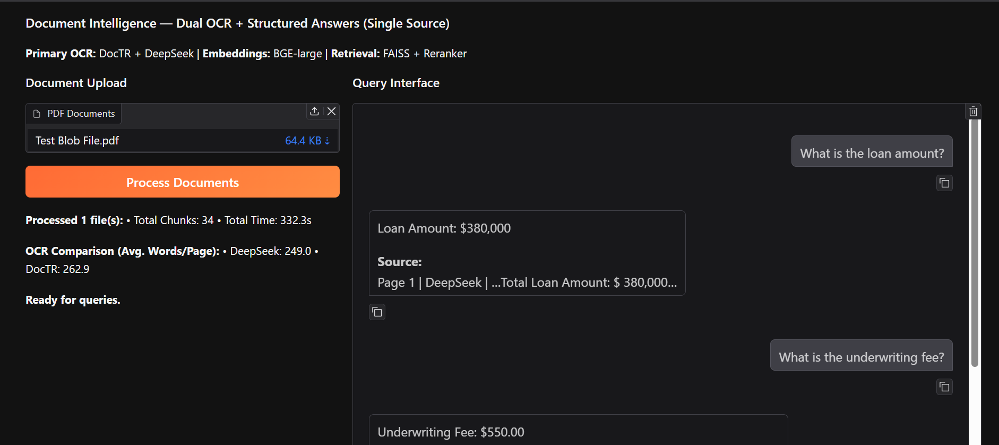
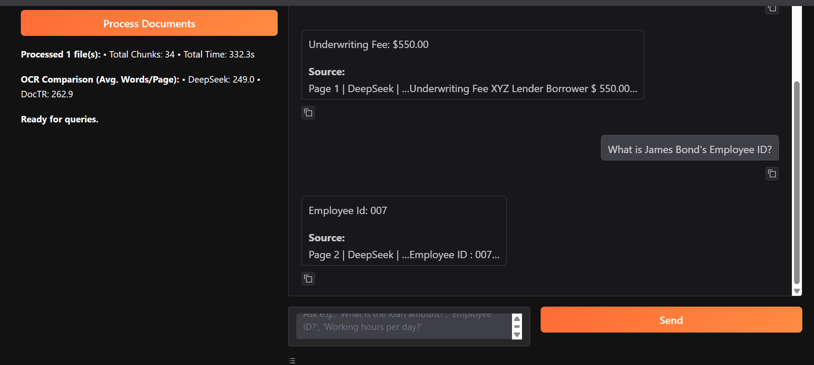
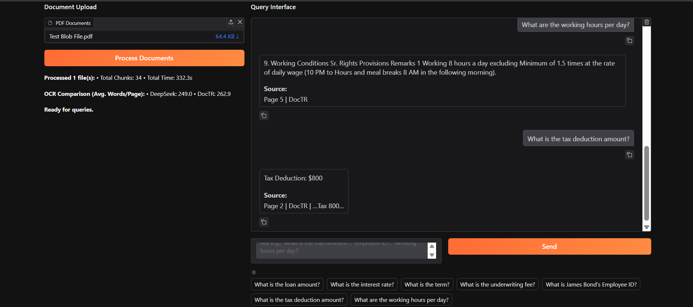
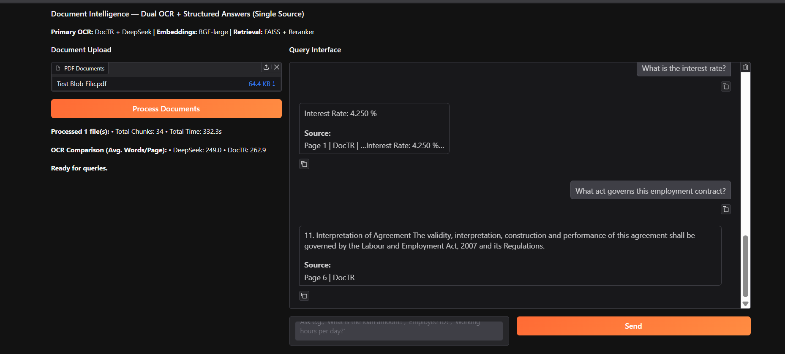

# Mortgage Document Intelligence System

> **Live interactive walkthrough:** https://triplemodelrag.vercel.app
> An interactive companion site (in [`site/`](./site)) covers the RAG pipeline, chunking
> and embedding techniques, 3D vector retrieval, a guardrailed chatbot, security, evals,
> and impact. See [`site/README.md`](./site/README.md) for GIFs and details.

| | |
| :---: | :---: |
|  |  |
|  |  |
|  |  |
|  |  |
|  |  |

Three production RAG (Retrieval-Augmented Generation) pipelines for processing 200+ page mortgage PDFs. Each pipeline uses a different OCR strategy, all delivering natural language Q&A with source citations, confidence scores, and a Gradio UI.

Built during an AI Engineering externship at [Outamation](https://www.outamation.com/), where the goal was to find the most reliable extraction approach for complex mortgage documents — scanned pages, tables, degraded quality, and multi-hundred-page packages.

---

## Three Pipelines, Three OCR Strategies

| Pipeline | File | Primary OCR | Embeddings | LLM | Key Strength |
|----------|------|-------------|------------|-----|-------------|
| **V1** | `pipeline_v1_doctr_deepseek.ipynb` | DocTR + DeepSeek OCR | BGE-large-en-v1.5 + Reranker | DeepSeek via Replicate | Word-level bounding boxes for source highlighting; dual OCR comparison |
| **V2** | `pipeline_v2_chandra.ipynb` | Chandra OCR | BGE-large-en-v1.5 + Reranker | Chandra via Replicate | 40+ language support; 99.99% multilingual accuracy; 83.1 benchmark score |
| **V3** | `pipeline_v3_multitier.ipynb` | 5-tier cascade (PyMuPDF → pdfplumber → PyPDF2 → Tesseract → EasyOCR) | sentence-transformers/all-mpnet-base-v2 | Groq Llama 3 70B | Zero external OCR dependency; handles any PDF type via fallback |

All three share the same core architecture: extract text → chunk semantically → embed → index in FAISS → retrieve → generate answer with source attribution.

---

## Why Three Versions?

Mortgage documents are unpredictable. A single loan package might contain native digital text, scanned pages from the 1980s, handwritten annotations, and complex fee tables — all in one PDF. No single OCR engine handles everything well.

**V1 (DocTR + DeepSeek)** was built first. DocTR provides word-level bounding boxes, enabling visual source highlighting on the original page. DeepSeek OCR runs as a secondary engine via Replicate, and the system compares outputs from both to select the highest-quality extraction per page. Uses BGE-large embeddings with a cross-encoder reranker for high-precision retrieval.

**V2 (Chandra OCR)** was built to test a newer engine. Chandra scored 83.1 on OCR benchmarks, supports 40+ languages with 99.99% multilingual accuracy, and processes pages at 0.025s on H100 GPUs. It runs via Replicate with retry logic and timeout handling. Same BGE + reranker retrieval stack as V1. Best for multilingual or math-heavy mortgage documents.

**V3 (Multi-Tier Fallback)** was built for zero-cost, zero-dependency reliability. Instead of relying on any external API for OCR, it cascades through five local extraction methods, keeping the highest-confidence result. Uses sentence-transformers for embeddings and Groq's free-tier Llama 3 70B for generation. Best for environments where external API access is restricted.

---

## System Architecture

```text
                    ┌─────────────────────────────────┐
                    │         PDF Upload              │
                    └──────────┬──────────────────────┘
                               │
              ┌────────────────┼────────────────┐
              ▼                ▼                ▼
     ┌────────────┐   ┌─────────────┐   ┌────────────────┐
     │  V1: DocTR │   │ V2: Chandra │   │ V3: 5-Tier     │
     │  + DeepSeek│   │    OCR      │   │ Cascade        │
     └─────┬──────┘   └──────┬──────┘   └───────┬────────┘
           │                 │                  │
           └─────────────────┼───────────────────┘
                             ▼
                  ┌──────────────────────┐
                  │  Semantic Chunking   │
                  │  (sentence-boundary, │
                  │   overlap, metadata) │
                  └──────────┬───────────┘
                             ▼
                  ┌──────────────────────┐
                  │  Embedding + Index   │
                  │  BGE-large or MPNet  │
                  │  FAISS L2 search     │
                  └──────────┬───────────┘
                             ▼
                  ┌──────────────────────┐
                  │  Retrieval + Rerank  │
                  │  (V1/V2: cross-encoder│
                  │   reranker)          │
                  └──────────┬───────────┘
                             ▼
                  ┌──────────────────────┐
                  │  Answer Generation   │
                  │  Groq / DeepSeek /   │
                  │  Replicate           │
                  └──────────┬───────────┘
                             ▼
                  ┌──────────────────────┐
                  │  Gradio UI           │
                  │  Chat + Sources +    │
                  │  Confidence Scores   │
                  └──────────────────────┘
