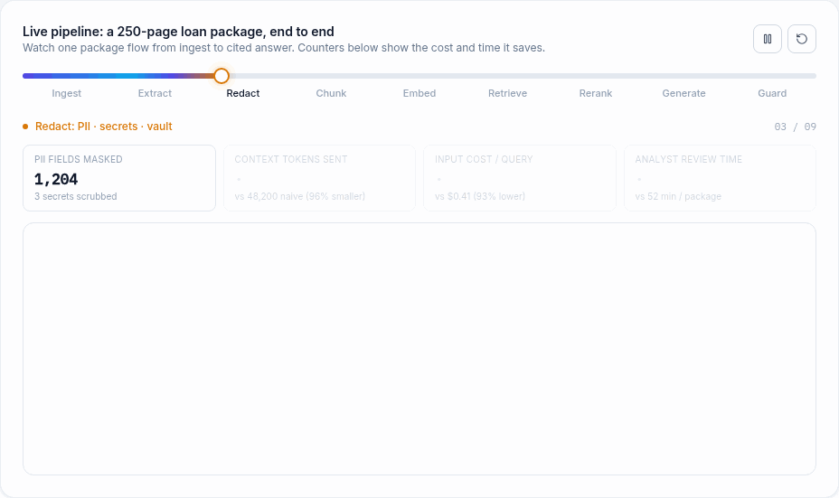
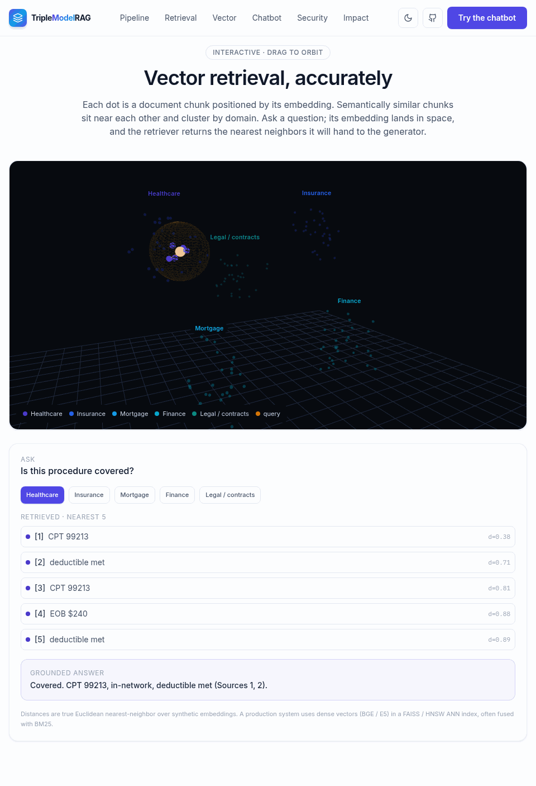
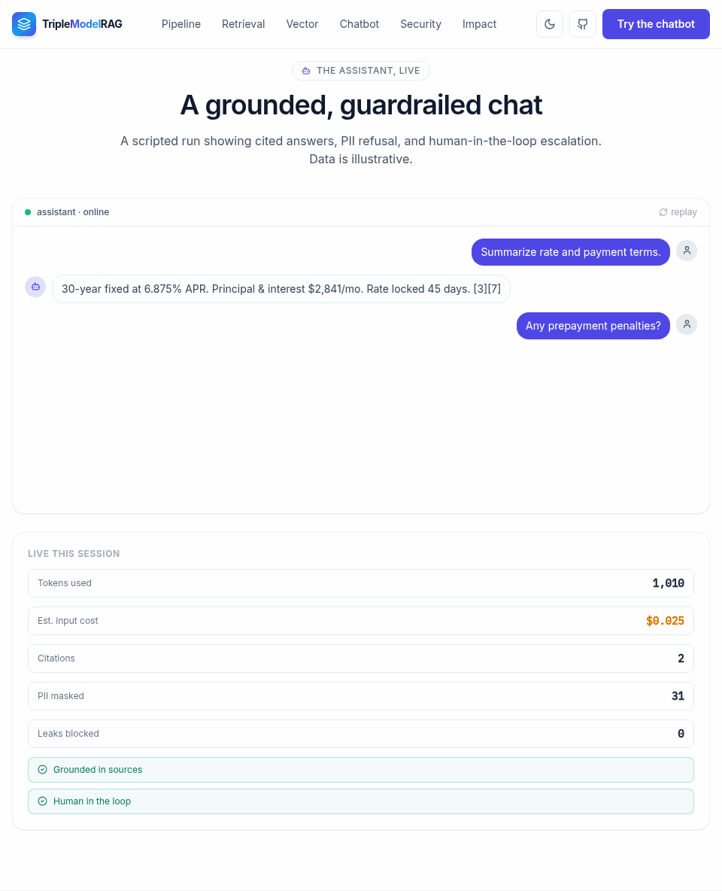
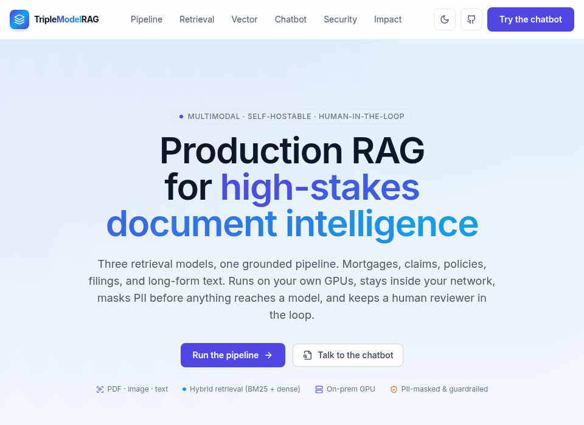

# TripleModelRAG (site)

Interactive companion site for the [Triple-Ocr-Rag](https://github.com/HarshMehta9000/Triple-Ocr-Rag) project.

**Live:** https://triplemodelrag.vercel.app · **Demos:** `public/` GIFs

<p align="center">
  
</p>
<p align="center">
  
  
  
</p>

A production-RAG walkthrough: a live pipeline simulation with real-time cost and review-time
counters, a deep retrieval stack (chunking, embedding families and frameworks, retrieval,
prompting), an interactive 3D vector-search view, a grounded and guardrailed chatbot
simulation, security with offline / on-prem-GPU / WiFi-only deployment modes, evals, and an
impact dashboard. Provider-agnostic (no vendor lock-in), PII-masked and guardrailed, no em
dashes.

## Run locally

```bash
npm install
npm run dev        # http://localhost:3000
npm run test:rag   # chunking + BM25 + PII unit tests
```

## Deploy

This app lives in `site/`. Deploy this directory:
- **Vercel:** `vercel --prod` (project root = `site/`)
- **Netlify:** build `npm run build`, publish `.next`, with `@netlify/plugin-nextjs`.

## Security & privacy
Input PII/secrets are masked before the model; output is scanned for leakage and redacted.
Keys are client-side only. See `src/lib/pii.ts`.

## Layout
```
src/app/
  api/ask/route.ts        provider-agnostic, multimodal, PII-masked
  components/             Hero, PipelineAnimation, RetrievalStack, VectorSearch3D,
                          ChatbotSimulation, Security, EvalsGuardrails, Impact, Demo
src/lib/                  rag (BM25), pdf (unpdf), pii, models
```
